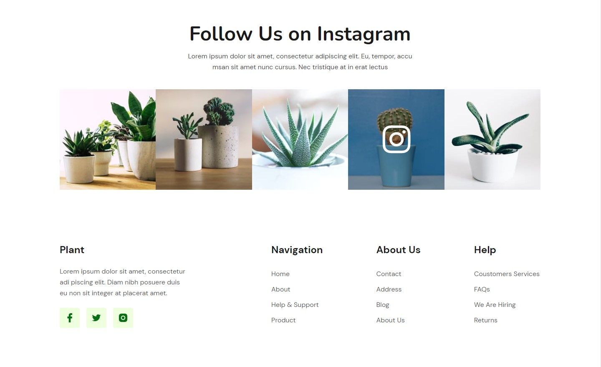

<h1 style="font-size: 48px; margin-bottom: 30px;">Plant</h1>

<b style="font-size: 20px;">Plant</b> - is a minimalist home plant-themed landing page. Desktop version.

<h2>This project was created using:</h2>
<ul>
<li>HTML</li>
<li>SCSS</li>
</ul>

